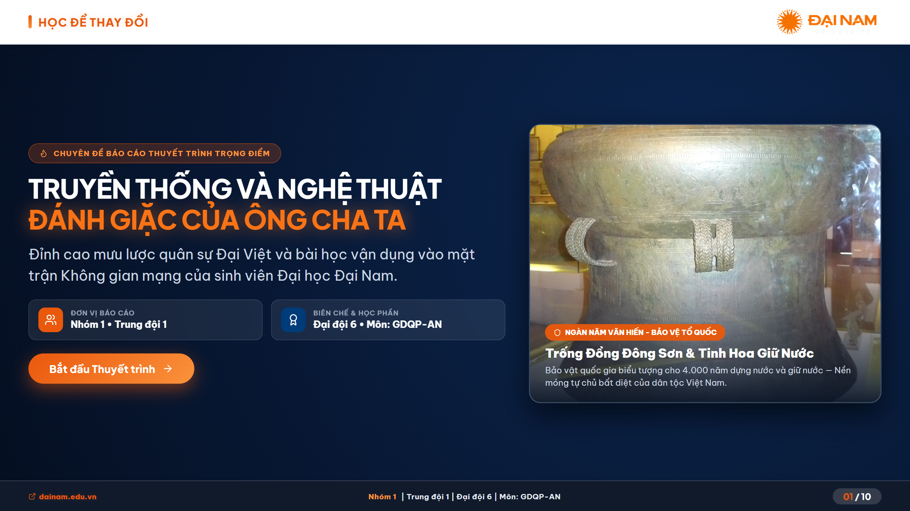
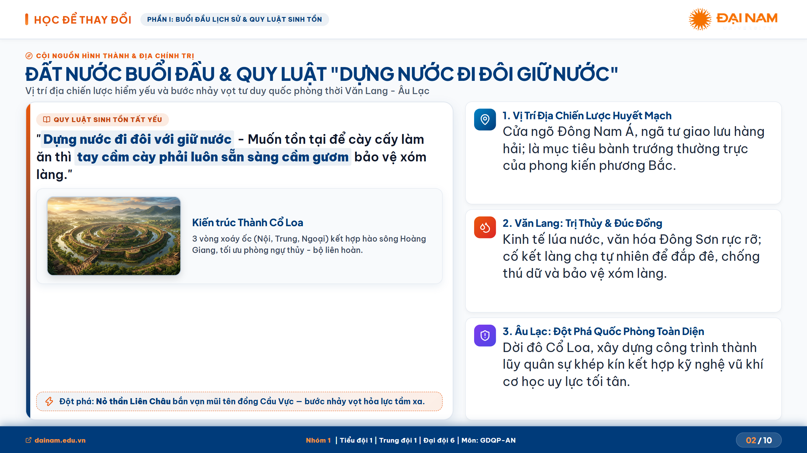
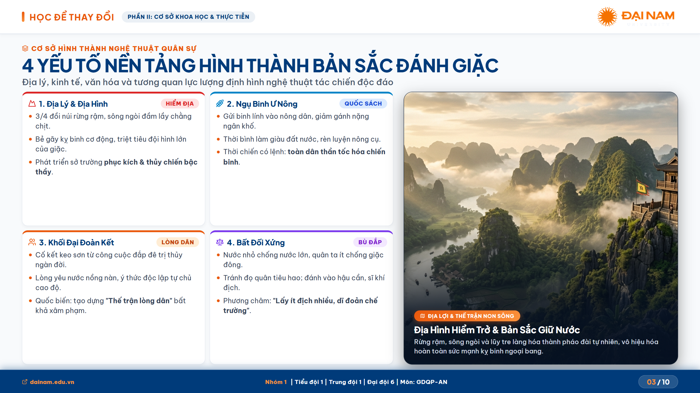
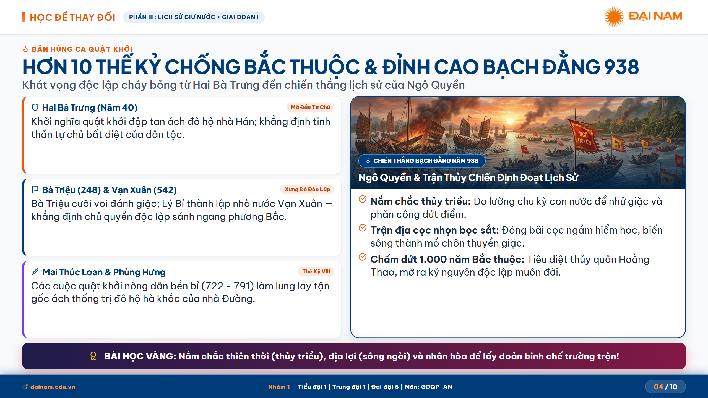
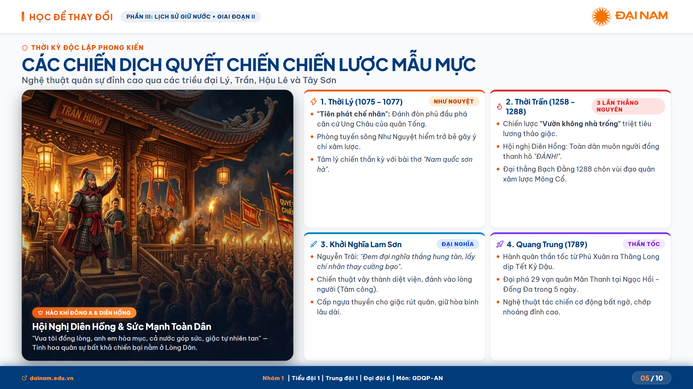
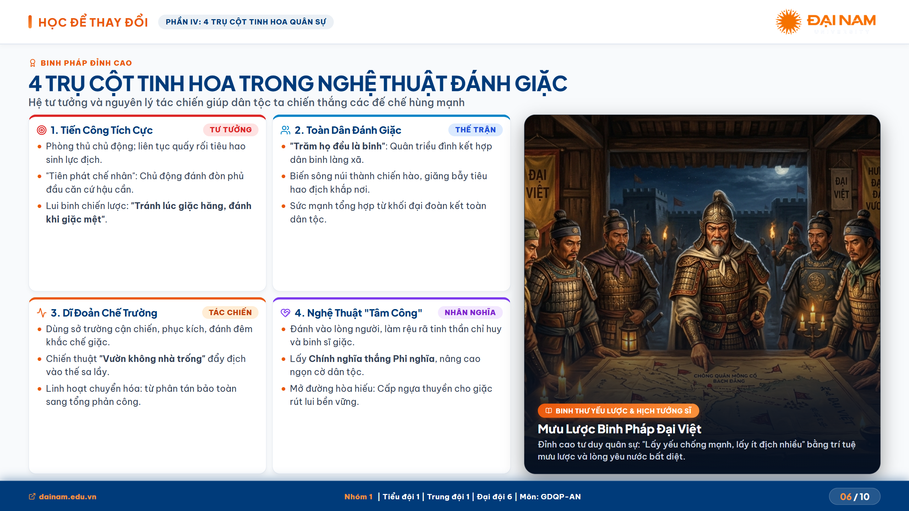
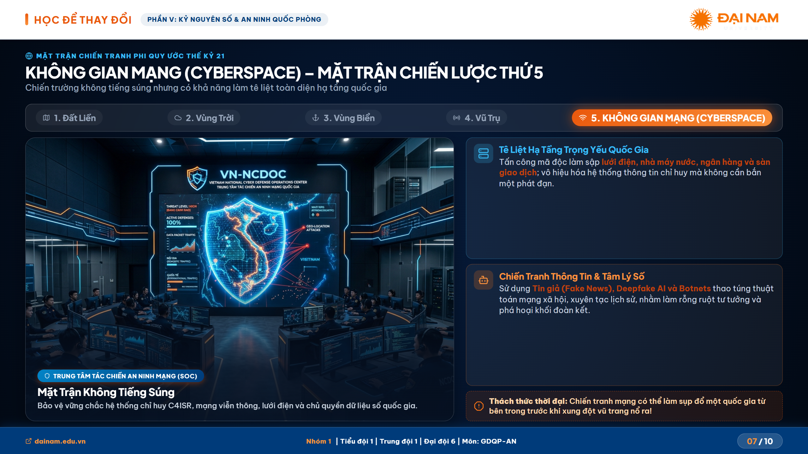
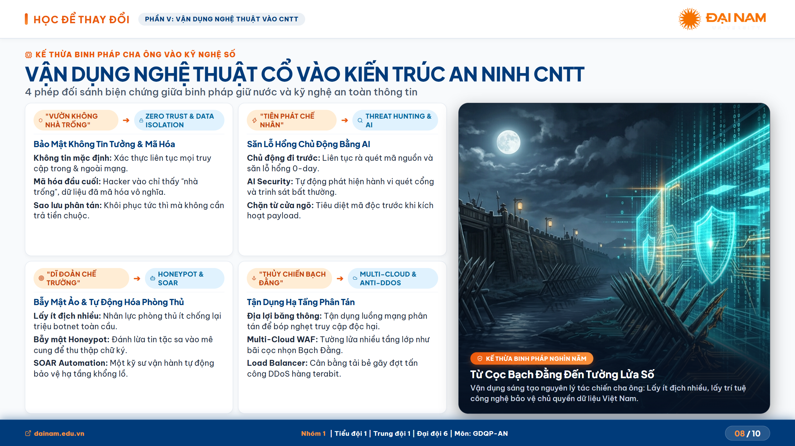
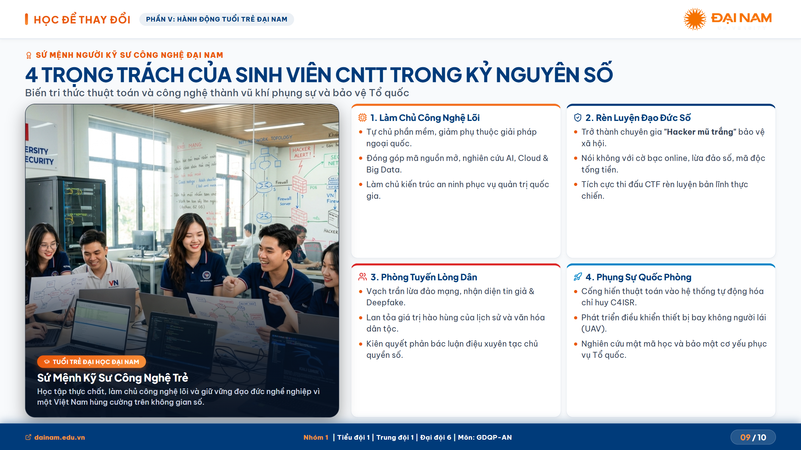
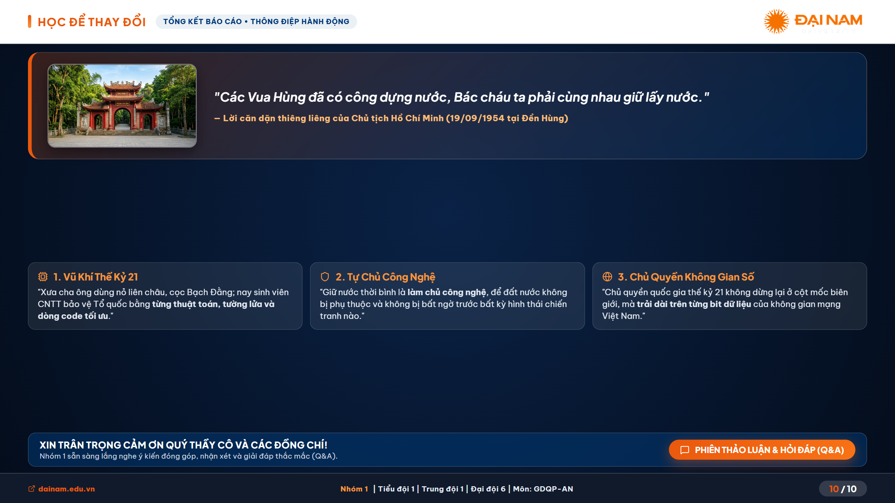

# BÁO CÁO THUYẾT TRÌNH GIÁO DỤC QUỐC PHÒNG & AN NINH
## Chuyên Đề: Truyền Thống & Nghệ Thuật Đánh Giặc Của Ông Cha Ta
> **Đơn vị thực hiện:** Nhóm 1 • Tiểu đội 1 • Trung đội 1 • Đại đội 6  
> **Đơn vị đào tạo:** Trường Đại học Đại Nam (DNU)  
> **Khẩu hiệu:** "HỌC ĐỂ THAY ĐỔI"

---

## 🌐 LINK TRÌNH CHIẾU TRỰC TUYẾN (LIVE WEB DEMO)
👉 **Truy cập bài thuyết trình tương tác trực tiếp:**  
**[https://thehilichurl.github.io/slide1/](https://thehilichurl.github.io/slide1/)**

---

## 📥 TẢI VỀ BẢN XUẤT 2K SIÊU NÉT (PPTX & PDF)
Toàn bộ 10 slide đã được xuất bằng cơ chế **Canvas 2K QHD (2560 x 1440 px)**, tự động loại bỏ giao diện điều khiển web và đồng hồ bấm giờ, sẵn sàng cho việc trình chiếu hoặc in ấn:

- 📊 **PowerPoint Presentation (16:9 Widescreen):**  
  👉 **[Tải file PPTX (2K)](./exports/Thuyet_Trinh_QPAN_DaiNam_2K.pptx)** *(~15.3 MB)*
- 📄 **Tài liệu PDF Khổ ngang (16:9 Landscape):**  
  👉 **[Tải file PDF (2K)](./exports/Thuyet_Trinh_QPAN_DaiNam_2K.pdf)** *(~3.7 MB)*

---

## 🎯 CÁC TÍNH NĂNG NỔI BẬT

1. **Định danh thương hiệu Đại học Đại Nam ("Đại Nam Style"):**
   - Slogan *"HỌC ĐỂ THAY ĐỔI"* nổi bật trên thanh header cùng logo nhận diện chuẩn.
   - Tone màu nhận diện cam Đại Nam (`#F37021` / `#EA580C`) kết hợp xanh Cobalt quân sự (`#003B7A`).
   - Thanh footer hiển thị định danh nhóm, môn học và liên kết chính thức `dainam.edu.vn`.

2. **Giao diện tối ưu máy chiếu (Projector-Optimized):**
   - Không gian chuẩn tỷ lệ 16:9 (`1920x1080`), tự động co giãn (`transform: scale`) tương thích mọi độ phân giải màn hình (Projector, Laptop, TV, Mobile).
   - Typography cỡ lớn (27px - 50px), độ tương phản cao, scannable cards, dễ quan sát từ khoảng cách xa.

3. **Công nghệ xuất bản kép Canvas 2K:**
   - Chụp tự động từng slide ở độ phân giải 2K (2560x1440).
   - Tự động đóng gói thành file **PPTX** và **PDF** ngay trên trình duyệt với thanh tiến trình trực quan.
   - Tự động bảo toàn tỷ lệ khung hình ảnh bằng kỹ thuật offscreen crop chống méo.
   - Tuyệt đối không chụp dính nút điều hướng HUD, thanh tiến độ hay bộ đếm thời gian.

4. **Hệ thống phím tắt thuyết trình chuyên nghiệp:**
   - `→` / `Phím cách (Space)` / `PageDown`: Chuyển sang slide tiếp theo.
   - `←` / `PageUp`: Quay lại slide trước.
   - `F`: Bật / Tắt chế độ Toàn màn hình (Fullscreen).
   - `H`: Bật / Tắt chế độ Tập trung (Focus Mode - ẩn toàn bộ thanh HUD).
   - `?`: Mở bảng hướng dẫn phím tắt.

---

## 📋 NỘI DUNG 10 SLIDE CHI TIẾT

| Slide | Chủ Đề | Nội Dung Trọng Tâm |
| :---: | :--- | :--- |
| **01** | **Bìa Thuyết Trình** | Kỳ quan quân sự Cổ Loa, thông tin chuyên đề & đơn vị báo cáo. |
| **02** | **Buổi Đầu Lịch Sử & Sinh Tồn** | Vị trí địa chiến lược, thời kỳ Văn Lang - Âu Lạc, kiến trúc Cổ Loa & Nỏ Liên Châu, quy luật "Dựng nước đi đôi với giữ nước". |
| **03** | **4 Yếu Tố Hình Thành Nghệ Thuật** | Yếu tố Địa lý hiểm trở, Kinh tế Ngụ binh ư nông, Khối đại đoàn kết toàn dân, Tương quan bất đối xứng - Dĩ đoản chế trường. |
| **04** | **Chống Bắc Thuộc & Bạch Đằng 938** | Khởi nghĩa Hai Bà Trưng, Bà Triệu, Vạn Xuân; Trận thủy chiến Bạch Đằng của Ngô Quyền chấm dứt 1000 năm Bắc thuộc. |
| **05** | **Độc Lập Tự Chủ Phong Kiến** | Chiến dịch Tiền Lê (981), Phòng tuyến Như Nguyệt (Lý), 3 lần đại thắng Mông-Nguyên & Hội nghị Diên Hồng (Trần), Lam Sơn & Tây Sơn thần tốc. |
| **06** | **4 Trụ Cột Tinh Hoa Binh Pháp** | Tiến công tích cực chủ động phòng ngự; Toàn dân đánh giặc - thế trận lòng dân; Cơ động dĩ đoản chế trường; Quân sự kết hợp đòn "Tâm công" & ngoại giao. |
| **07** | **Không Gian Mạng: Mặt Trận Thứ 5** | Chiến trường không tiếng súng thế kỷ 21; Tê liệt hạ tầng trọng yếu; Chiến tranh thông tin, Fake news, Deepfake AI; Case studies thế giới. |
| **08** | **Vận Dụng Binh Pháp Cổ Vào CNTT** | Ma trận 4 phép đối sánh: Thanh dã ➔ Zero Trust; Tiên phát chế nhân ➔ Threat Hunting/AI; Dĩ đoản chế trường ➔ Honeypot/SOAR; Bạch Đằng ➔ Cloud Native/Anti-DDoS. |
| **09** | **Trọng Trách Sinh Viên CNTT Đại Nam** | Làm chủ công nghệ lõi; Rèn luyện đạo đức Hacker mũ trắng; Xây dựng phòng tuyến lòng dân trên MXH; Phụng sự chuyển đổi số quốc phòng (C4ISR/UAV). |
| **10** | **Tổng Kết & 3 Câu Kết Đắt Giá** | Lời dặn thiêng liêng của Bác Hồ tại Đền Hùng, 3 punchlines đắt giá của sinh viên CNTT, lời cảm ơn & phiên thảo luận Q&A. |

---

## 🖼️ XEM TRƯỚC HÌNH ẢNH 10 SLIDE (CANVAS 2K)

### Slide 01: Bìa Báo Cáo Thuyết Trình

### Slide 02: Buổi Đầu Lịch Sử & Quy Luật Sinh Tồn

### Slide 03: 4 Yếu Tố Nền Tảng Hình Thành Bản Sắc Đánh Giặc

### Slide 04: Hơn 10 Thế Kỷ Chống Bắc Thuộc & Mốc Son Bạch Đằng 938

### Slide 05: Các Chiến Dịch Quyết Chiến Chiến Lược Mẫu Mực

### Slide 06: 4 Trụ Cột Tinh Hoa Trong Nghệ Thuật Đánh Giặc

### Slide 07: Không Gian Mạng (Cyberspace) – Mặt Trận Chiến Lược Thứ 5

### Slide 08: Vận Dụng Nghệ Thuật Cổ Vào Kiến Trúc An Ninh CNTT

### Slide 09: 4 Trọng Trách Của Sinh Viên CNTT Trong Kỷ Nguyên Số

### Slide 10: Thông Điệp Lời Bác Dặn & 3 Câu Kết Đắt Giá

---
*© 2026 Nhóm 1 • Tiểu đội 1 • Trung đội 1 • Đại đội 6 • Môn GDQP-AN • Trường Đại học Đại Nam.*
